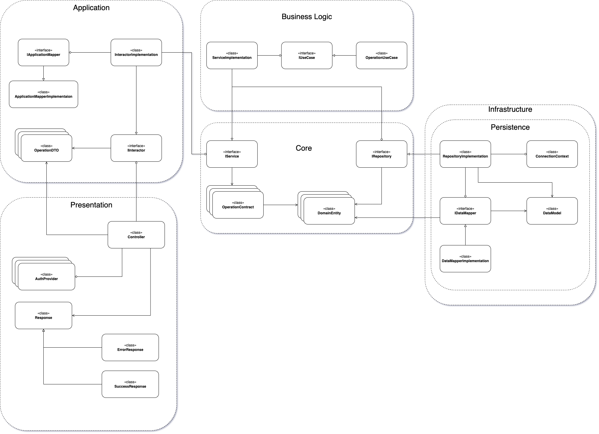

# Science archive project

## Welcome

Welcome to my pet project of Science Archive! The idea of this project is to create web-service allowing people to create and share worldwide their knowledges of any science kind.

## Backend architecture

Consider backend UML Class diagram below:

