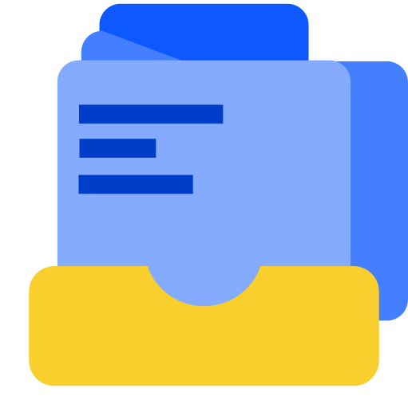
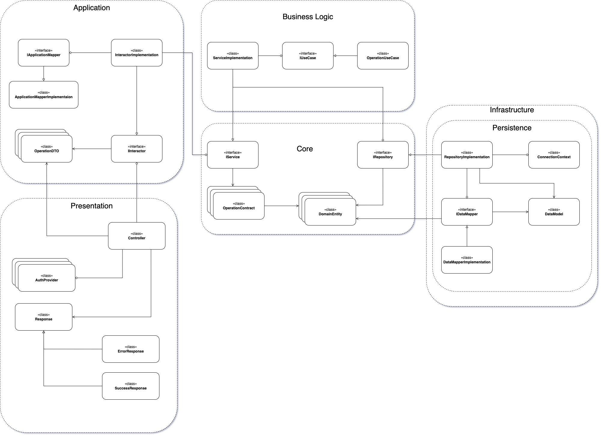
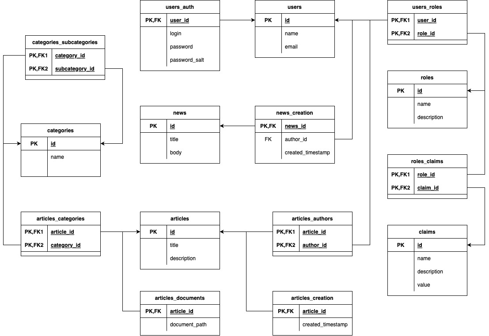

# Science Archive Project

  

  Welcome to my pet project of Science Archive! The idea of this project is to create web-service allowing people to create and share worldwide their knowledges of any science kind.

## Project Architecture

Whole project consists of the following services which are stored in separated directories:

- `ScienceArchive.Server` - main backend service. It was created following Clean Architecture principles and powered by .NET platform. All business logic is stored there;
- `science-archive-web` - client-side application, which is created with Angular as Single Page Application (SPA);
- `ScienceArchive.DB` - it is database project. There all SQL and NoSQL scripts are stored. There are two DBMS used - PostgreSQL for main data and ClickHouse for logs;
- `ScienceArchive.Mobile` - test mobile application created with .NET MAUI.
- `doc-store-api` - web API created with Go language. It is used to work with file storage: upload, download etc;
- `telegram-bot-api` - this is a web API service for interacting with Telegram API to send notifications to users, help to find information in service (articles, authors etc).

## Backend Architecture

Consider backend UML Class Diagram below:

## Data Persistence Architecture

Consider a template of database structure:

